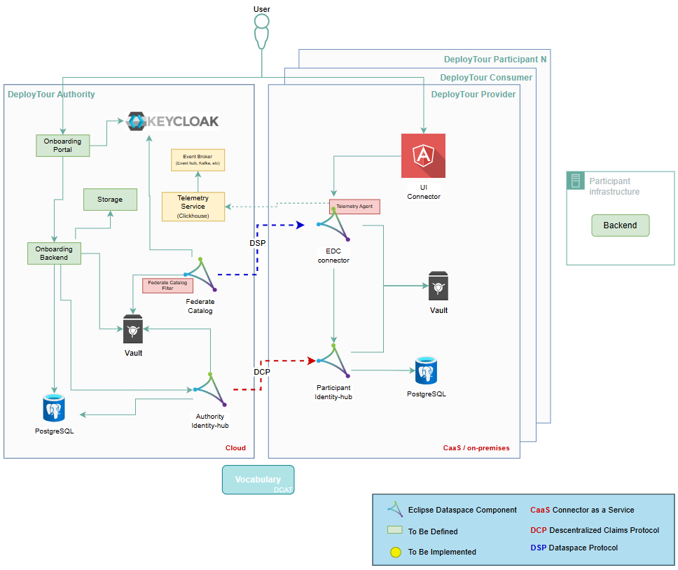

The component architecture of the dataspace is divided into two main domains: Operator (Central Part) and Participant. This separation reflects the federated nature of the dataspace while enabling centralized governance, identity, and compliance services.

# Operator vs. Participant View 

It identifies the central governance services (such as the Federated Catalog and Issuer) managed by the operator, contrasted with the private infrastructure of each participant (featuring an Angular Portal, Spring Boot Backend, and the EDC connector). This diagram is essential for understanding the deployment model and how value-added services integrate with the sovereign nodes of each organization.

## Authority Components 

### Onboarding Portal

The Dataspace Portal is the primary user-facing interface of the Espordata Operator. It serves as a single entry point for participants and administrators to interact with the Espordata ecosystem.

It is a core architectural component responsible for orchestrating and visualizing interactions with the underlying services, such as Identity, Compliance, and Catalogue.

- Current Responsibilities
- Central access point for administrators and participants
- Visualization of dataspace components and participant status

### Keycloak 
Keycloak is used as the central Identity Provider (IdP) for the dataspace.

Responsibilities

- Provide authentication and authorization for the Onboarding portal using OAuth 2.0 / OIDC
- Generate authentication tokens for access to the Issuer Service and Federated Catalog to avoid the use of x-api-key authentication
- Manage participant credentials (password creation, reset, and recovery)
- Provide a centralized view of the dataspace governance, participants, and compliance status

### Onboarding backend

The backend acts as the application core behind the Onboarding portal. It is responsible for orchestrating interactions with the underlying services, such as Identity, Compliance, and Catalogue. 

### Federate Catalog

The Federated Catalog is based on the Eclipse Dataspace Connector (EDC) federated catalog capabilities and acts as a logical aggregation layer for dataspace assets.

Responsibilities
- Periodically crawl participant connectors to discover published assets
- Cache asset metadata to improve discovery performance
- Normalize and enrich metadata using dataspace vocabularies
- Expose catalog APIs for search and discovery

Design Characteristics
- Acts as a cache, not a source of truth
- Does not store or manage actual data
- Preserves dataspace federation by avoiding central ownership of assets

### Authority Identity-hub

The Authority Identity-hub, based on the Identity Hub, is a core trust component operated by the dataspace operator. It acts as the trusted and issuer service for Verifiable Credentials (VCs) for participants and dataspace entities.

Responsibilities

- Issue Verifiable Credentials (VCs) to participants after successful onboarding and compliance validation
- Manage Decentralized Identifiers (DIDs) for the dataspace and its participants
- Sign credentials using qualified or organizational certificates
- Publish DID documents and verification material
- Support credential revocation and lifecycle management

Interactions

- Receives onboarding requests from the Operator Backend
- Uses the Central Vault to access cryptographic keys and trust anchor certificates
- Exposes secure APIs (OIDC / mTLS) consumed by participant Wallets
- Integrates with Keycloak for service-level authentication

## Participant Components

To facilitate participant integration, the Deploytour dataspace adopts a CaSS (connector-as-a-service) deployment model. Under this architecture, each participant is provisioned with a dedicated instance of the deploytour-connector component, ensuring isolated data processing and independent sovereign control.

### UI connector

The UI connector represents the user-facing component of a participant’s digital infrastructure within the dataspace. It is built upon an Eclipse Dataspace Connector (EDC) base, enriched with a customized dashboard and enhanced user experience. This connector serves as the primary interaction point for participant organizations, enabling them to manage their role as data providers, data consumers, or both.

### Participant Connector

The Eclipse Dataspace Connector (EDC) is the core runtime component operated by each participant, enabling data sharing and negotiation within the dataspace.

Responsibilities

- Publish asset metadata to the dataspace
- Handle contract negotiation and policy enforcement
- Execute secure data transfers between participants
- Enforce usage policies and access control

Technical Characteristics

- Version 0.16, supporting the Dataspace Control Protocol (DCP)
- Modular and extensible architecture
- Supports policy-driven data sharing

### Participant Identity-hub

The Participant Identity-hub, implemented using the Identity Hub, acts as a wallet and is responsible for managing the participant’s digital identity and credentials.

Responsibilities

- Store Verifiable Credentials (VCs) issued by the Issuer Service
- Present credentials during:
  - Onboarding
  - Contract negotiation
  - Compliance checks

- Manage DID keys and identity material

Design Principles
- Participant-owned and isolated
- No central access by the operator
