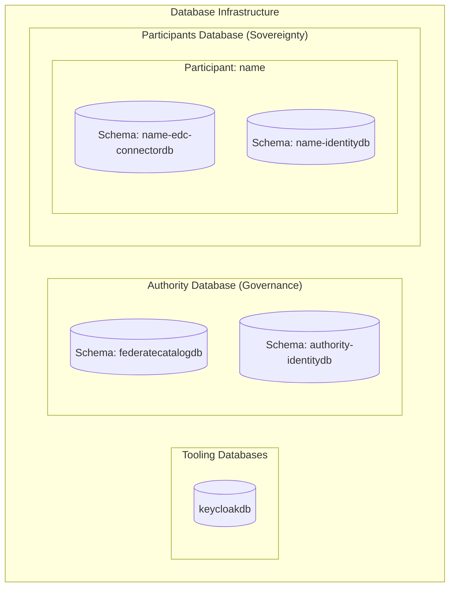

# Database Organization

The database architecture of the Deploytour dataspace is designed to separate application utility data from core business and governance data. It enforces data sovereignty and security through logical schema isolation.

---

## Database Categories

### 1. Tooling Databases (`ToolDBs`)
These databases store configuration, auditing, and platform settings for cluster management tools. They are completely separated from business-logic data.
* **keycloakdb**: Stores realm configurations, client registrations, and administration console states.

### 2. Authority Database (`AuthorityDB`)
Operated by the central dataspace operator, this database stores metadata for governance, onboarding, and compliance. To enforce separation of concerns, each central component uses its own isolated schema.
* **Schemas**:
  * **`federatecatalogdb`**: Caches catalog dataset metadata collected from participant nodes.
  * **`authority-identitydb`**: Stores authority key material metadata and issued Verifiable Credentials (VCs).

### 3. Participants Database (`ParticipantsDB`)
To support the Connector-as-a-Service model efficiently without deploying separate database servers for every single participant, a shared database server is used. However, **absolute data isolation** is enforced by provisioning dedicated schemas for each participant.
* **Schemas per Participant**:
  * **`<name>-edc-connectordb`**: Stores the participant's contract agreements, negotiation states, asset metadata, and transfer process history.
  * **`<name>-identitydb`**: Stores the participant's local identity metadata and Verifiable Credentials (VCs).

---

## Schema Isolation Benefits

* **Security**: Restricting database access permissions at the schema level ensures that a participant can only read and write to their own schemas.
* **Scalability**: New participants can be onboarded dynamically by executing schema creation scripts without needing to configure new database instances.
* **Maintenance**: Simplifies backup policies, allowing the central authority to back up governance data separately from participant operational data.
