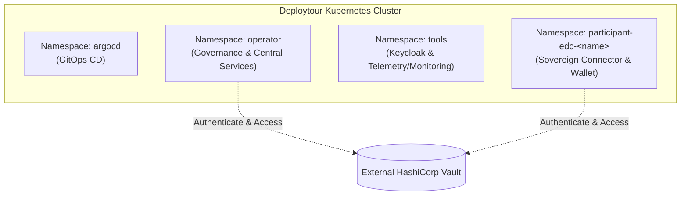

# Kubernetes Namespaces Distribution

To ensure security, logical segregation, and efficient resource management, the Deploytour dataspace cluster is structured into distinct Kubernetes namespaces. This separation isolates administrative and central components from participant environments.

---

## Namespaces Breakdown

### 1. `argocd`
This namespace is dedicated entirely to the deployment and operation of **ArgoCD**. It manages the Continuous Delivery (CD) pipeline of the dataspace, implementing GitOps principles to synchronize the cluster's state with the git repository configuration.
* **Key Components**: ArgoCD Application Controller, Repo Server, and API Server.

### 2. `operator`
Hosts the central governance and administrative applications of the dataspace. These are operated by the central authority to orchestrate onboarding, compliance, and catalog federation.
* **Hosted Components**:
  * **onboarding-portal**: Web GUI for user onboarding and administrator oversight.
  * **onboarding-backend**: Business logic orchestration.
  * **federated-catalog**: Aggregates asset metadata across the dataspace.
  * **authority-identity-hub**: Manages Central Decentralized Identifiers (DIDs) and issues Verifiable Credentials (VCs).

### 3. `tools`
Contains shared backing utilities and monitoring systems. These services support the cluster's security and observability.
* **Hosted Components**:
  * **keycloak**: Central Identity Provider (IdP) for web portals and API clients.
  * **Audit & Telemetry**: OpenTelemetry collector and ClickHouse database for high-performance log and audit trail analysis.
  * **Monitoring Stack**: Prometheus (metrics ingestion), Grafana (visualization), Loki (log aggregation), and Tempo (distributed tracing).

### 4. `participant-edc-<name>`
A dynamically provisioned namespace created **for each participant** who joins the dataspace. This guarantees absolute runtime isolation, preventing participants from accessing each other's pods, secrets, or configurations.
* **Naming Convention**: `participant-edc-<participant-name>` (e.g., `participant-edc-participant1`).
* **Hosted Components**:
  * **name-identity-hub**: Wallet managing the participant's Verifiable Credentials (VCs).
  * **name-gui-connector**: Graphical interface for managing connector assets, policies, and contracts.
  * **name-edc-connector**: Composed of the Control Plane (negotiations and policies) and the Data Plane (secure data channel).
