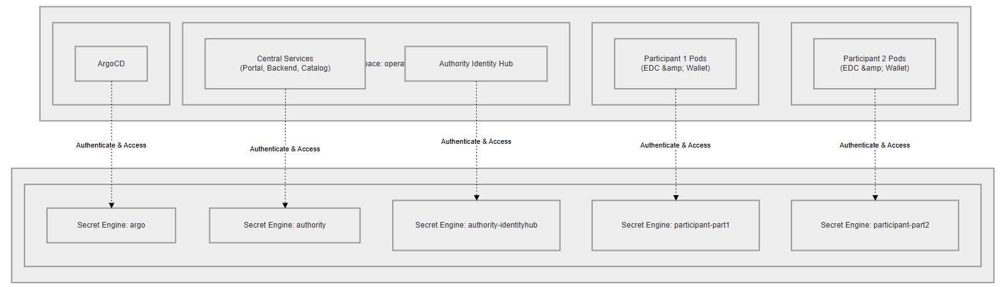
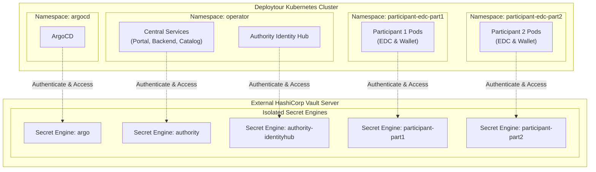

# HashiCorp Vault Architecture

To ensure the highest level of cryptographic security, credential protection, and operational efficiency, the Deploytour dataspace implements **HashiCorp Vault** as its centralized secret management system.

Instead of deploying and managing multiple Vault instances, the platform utilizes a single, highly available Vault instance deployed outside the Kubernetes cluster, leveraging Vault's native isolation capabilities.

---

## Architectural Diagram

The diagram below illustrates how components inside the Kubernetes cluster authenticate and interact with their respective isolated Secret Engines hosted on the external Vault server.

---

## Key Design Principles

### 1. Separation from the Kubernetes Cluster
Vault is hosted on infrastructure completely independent of the main Kubernetes cluster. This separation offers key security and operational advantages:
* **Blast Radius Reduction**: If the Kubernetes cluster is compromised, the root cryptographic keys and vault configurations remain secure.
* **Independent Lifecycle**: Maintenance, updates, scaling, and backups of Vault can be performed without interrupting cluster operations.
* **Disaster Recovery**: Since keys are stored outside the cluster, recovering a destroyed or failed cluster is simplified.

### 2. Single Vault Instance (Resource & Admin Efficiency)
Managing Vault at scale involves substantial administrative overhead (unsealing processes, key management, system updates, policy auditing, backup verification).
* **Resource Optimization**: Deploying a single Vault instance avoids the heavy CPU and memory footprint of running a dedicated Vault instance for each participant.
* **Simplified Administration**: Administrators only need to manage, audit, and patch a single Vault deployment, reducing operational cost and human error risk.

### 3. Isolated Secret Engines (Multi-Tenancy & Sovereignty)
To guarantee strict data isolation between the dataspace authority and individual participants, Vault's multi-tenancy capabilities are leveraged:
* **Secret Engines Mapping**: Vault is structured into the following Key-Value (KV) Secret Engines to partition credentials and keys logically:
  * **`argo`**: Dedicated engine for ArgoCD to manage GitOps/deployment secrets.
  * **`authority`**: Shared engine for general authority/central services (such as the Onboarding Portal, Onboarding Backend, and Federated Catalog in the `operator` namespace).
  * **`authority-identityhub`**: Dedicated engine specifically for the Authority Identity Hub to manage authority credential-issuing keys and DID materials.
  * **`participant-<name>`**: An isolated, dedicated engine for each participant (e.g., `participant-participant1`) containing secrets for both their EDC connector (Control Plane/Data Plane) and their Participant Identity Hub.
* **Data Segregation**: Encryption keys and secrets are physically and logically segregated at the Vault engine level. A secret engine provisioned for one participant is completely invisible and inaccessible to any other participant or component.

### 4. Access Control & Authentication
Vault utilizes fine-grained policies to enforce the Principle of Least Privilege:
* **Kubernetes Authentication Method**: Pods authenticate with Vault using their native Kubernetes Service Accounts.
* **Scoped Policies**: Upon successful authentication, Vault issues a short-lived token bound to a policy that permits access *only* to the specific Secret Engine path belonging to that component or tenant (e.g., pods running inside the namespace `participant-edc-part1` can only read/write secrets located in the `participant-part1` secret engine).
