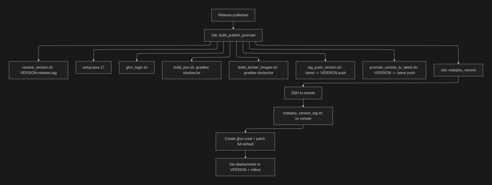

# Pipeline guide: `devbox-release-deploy.yml`

## 1) When it runs

This workflow is triggered when a **Release is published**:

- `release: types: [published]`

It also defines **concurrency**, so there is only one “devbox” deployment running at a time.

**Source code (workflow path in repo):**
- `.github/workflows/devbox-release-deploy.yml`

---

## 2) Relevant global variables

- **REGISTRY**
- **NAMESPACE**: `default`
- **DEVBOX_COMPONENTS**: list of images/components that are built/published and then redeployed

---

## 3) Pipeline jobs

### Job A — `build_publish_promote`

Builds and publishes artifacts + promotes `latest`.

**Steps:**
1. Checkout
2. Resolve `VERSION`: takes the release `tag_name` and uses it as `VERSION`
3. Setup Java 17 (for Gradle)
4. Login to GHCR (PAT)
5. Build JARs:
    - `./gradlew shadowJar`
6. Build Docker images:
    - `./gradlew dockerize`
7. Tag & Push VERSION:
    - tags `:latest` locally as `:${VERSION}` and pushes to the registry
8. Promote VERSION -> latest:
    - pulls `:${VERSION}`, tags to `:latest` and pushes

**Job output:**
- Exposes `version` for the next job.

---

### Job B — `redeploy_version`

Connects via SSH to the remote machine and executes the redeploy.

**Steps:**
1. Checkout (only to have the repo in the runner; the real redeploy is remote)
2. SSH to the machine with `appleboy/ssh-action` and execute:
    - `.github/workflows/scripts/redeploy_version_tag.sh`
    - inside the already cloned remote repo

---

## 4) What the remote redeploy actually does (`redeploy_version_tag.sh`)

**Technical summary:**
- Re-creates the GHCR secret `ghcr-cred` in the namespace
- Attaches it to `serviceaccount/default`
- For each deployment listed in `DEVBOX_COMPONENTS`:
    - forces `imagePullPolicy=Always`
    - continues with update/rollout
    - considers “stuck rollout”
    - if it detects pods in `Terminating`, it may force delete them to unblock the rollout

**Important point:**
This is **not** a hard reset of the environment. It is a **redeploy/retag/rollout** of deployments: it adjusts images/pull policy and forces the cluster to consume `:${VERSION}`.

---

## 5) Versioning decision: why version is “set” in the deployment and not in the product repo

### 5.1 What problem is being covered today

There is an explicit comment in `restart_devbox.sh`:

> “Terraform/Helm values still reference tag=latest, so we map latest -> 0.1.”

And the script allows:

- `ENSURE_LATEST_TAGS=true` to “fabricate” `:latest` from a base tag (`TAG_BASE=0.1`)

This indicates:

- current IaC (Terraform/Helm) is coupled to `:latest`
- release process wants to promote versions and redeploy without touching the original product repo

---

### 5.2 Critical evaluation (for production)

Using `latest` in production is usually a bad idea because:

- It does not guarantee reproducibility
- It makes exact rollback harder
- It can introduce uncontrolled changes if `latest` moves by mistake

The current approach (promoting and forcing `latest`, or patching deployments to point to `:${VERSION}`) is operationally valid for **MVD/devbox**, but for production the correct approach would be:

**Recommended option**
- Parameterize Terraform/Helm to deploy immutable tags (`:${VERSION}`)
- Pipeline should run `terraform apply` with that version (or update values) instead of patching deployments manually

**How it would be addressed**
- Add an `imageTag`/`version` variable in Terraform/Helm
- Pipeline: instead of “promote latest”, pass `VERSION` to IaC
- Keep `latest` only for ephemeral environments or tests

---

## 6) Flow diagrams (text form)

### High-level flow

1. Release published
2. Job `build_publish_promote`
    - `resolve_version.sh`: `VERSION=release.tag`
    - `setup-java 17`
    - `ghcr_login.sh`
    - `build_jars.sh`: `gradlew shadowJar`
    - `build_docker_images.sh`: `gradlew dockerize`
    - `tag_push_version.sh`: `:latest -> :VERSION` push
    - `promote_version_to_latest.sh`: `:VERSION -> :latest` push
3. Job `redeploy_version`
    - SSH to remote
    - run `redeploy_version_tag.sh` on remote
    - create `ghcr-cred` + patch `serviceaccount/default`
    - set deployments to `VERSION` + rollout

