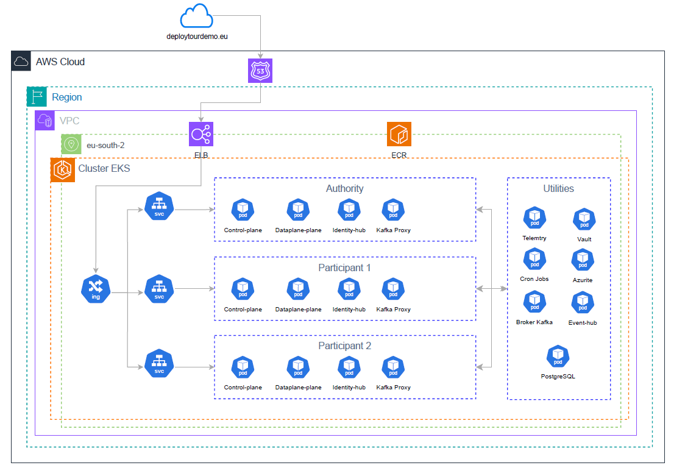

# MVD - EONAX

**Introducción**:

Este documento detalla el proceso completo de despliegue y ejecución de
los tests end-to-end del **MVD de Eona-X**.

**Contexto del Proyecto**

El objetivo es validar el funcionamiento de un dataspace mínimo viable
(MVD - Minimum Viable Dataspace) que simula el intercambio seguro de
datos entre participantes en el ecosistema.



Componentes Principales

- **Authority**: Autoridad de confianza que emite credenciales

- **Provider**: Organización que ofrece datos/APIs

- **Consumer**: Organización que consume datos

**Instalación de MVD**

Los pasos basicos para instalación de este MVD se encuentran en el
siguiente readme

<https://github.com/AmadeusITGroup/dataspace-ecosystem/blob/main/system-tests/readme.md>

**Problemas:**

Al ejecutar el comand
```
terraform -chdir=system-tests apply -auto-approve
-var=\"environment=local\"
```

el resultado era fallido, dado que los scripts de terraform buscan
imágenes de docker que inician con localhost

por ejemplo `localhost/kafka-proxy-k8s-manager:latest`

Para solventar dicho problema es necesario re-taggear las imagenes
construidas:
```
docker tag control-plane-postgresql-hashicorpvault:latest
localhost/control-plane-postgresql-hashicorpvault:latest

docker tag data-plane-postgresql-hashicorpvault:latest
localhost/data-plane-postgresql-hashicorpvault:latest

docker tag federated-catalog-postgresql-hashicorpvault:latest
localhost/federated-catalog-postgresql-hashicorpvault:latest

docker tag identity-hub-postgresql-hashicorpvault:latest
localhost/identity-hub-postgresql-hashicorpvault:latest

docker tag issuer-service-postgresql-hashicorpvault:latest
localhost/issuer-service-postgresql-hashicorpvault:latest

docker tag telemetry-service-postgresql-hashicorpvault:latest
localhost/telemetry-service-postgresql-hashicorpvault:latest

docker tag telemetry-agent-postgresql-hashicorpvault:latest
localhost/telemetry-agent-postgresql-hashicorpvault:latest

docker tag backend-service-provider:latest
localhost/backend-service-provider:latest

docker tag telemetry-storage-postgresql-hashicorpvault:latest
localhost/telemetry-storage-postgresql-hashicorpvault:latest

docker tag telemetry-csv-manager-postgresql-hashicorpvault:latest
localhost/telemetry-csv-manager-postgresql-hashicorpvault:latest
```
Y luego es necesario cargar esas imagenes al cluster con kind, de la
siguiente manera

```
kind load docker-image \
control-plane-postgresql-hashicorpvault:latest \
localhost/control-plane-postgresql-hashicorpvault:latest \
data-plane-postgresql-hashicorpvault:latest \
localhost/data-plane-postgresql-hashicorpvault:latest \
federated-catalog-postgresql-hashicorpvault:latest \
localhost/federated-catalog-postgresql-hashicorpvault:latest \
identity-hub-postgresql-hashicorpvault:latest \
localhost/identity-hub-postgresql-hashicorpvault:latest \
issuer-service-postgresql-hashicorpvault:latest \
localhost/issuer-service-postgresql-hashicorpvault:latest \
telemetry-service-postgresql-hashicorpvault:latest \
localhost/telemetry-service-postgresql-hashicorpvault:latest \
telemetry-agent-postgresql-hashicorpvault:latest \
localhost/telemetry-agent-postgresql-hashicorpvault:latest \
backend-service-provider:latest \
localhost/backend-service-provider:latest \
telemetry-storage-postgresql-hashicorpvault:latest \
localhost/telemetry-storage-postgresql-hashicorpvault:latest \
telemetry-csv-manager-postgresql-hashicorpvault:latest \
localhost/telemetry-csv-manager-postgresql-hashicorpvault:latest \
federated-catalog-filter-postgresql-hashicorpvault:latest \
localhost/federated-catalog-filter-postgresql-hashicorpvault:latest \
kafka-proxy-entra-auth:latest \
localhost/kafka-proxy-entra-auth:latest \
kafka-proxy-k8s-manager:latest \
localhost/kafka-proxy-k8s-manager:latest \
-n dse-cluster
```
**¿Por qué cargar las imágenes?**

Kind es un cluster aislado. Necesita tener las imágenes dentro del
cluster para poder desplegarlas.

Luego de esto, es necesario volver a realizar un apply de terraform

terraform -chdir=system-tests apply -auto-approve
-var=\"environment=local\"

El resultado de esto es ver en estado Running o completed, los pods que
estan dentro del cluster


Que despliega **terraform**:

- **Infraestructura Base**

  - PostgreSQL (base de datos compartida)

  - Azure Event Hub (emulador local)

  - HashiCorp Vault (gestión de secretos)

  - Azurite (emulador de Azure Storage)

  - Kafka Broker (para streaming)

- **Por cada participante (Authority, Provider, Consumer)**

  - Control Plane (gestión de contratos y catálogo)

  - Data Plane (transferencia de datos)

  - Identity Hub (gestión de identidades)

  - Vault (instancia propia de secretos)

  - Init jobs (inicialización de base de datos)

- **Componentes específicos de Authority**

  - Issuer Service (emisión de credenciales)

  - Federated Catalog (catálogo centralizado)

  - Telemetry Service (recolección de eventos)

  - Telemetry Storage (almacenamiento de telemetría)

  - Telemetry CSV Manager (generación de reportes)

- **Componentes específicos de Provider**

  - Backend Service (APIs de datos reales)

  - Kafka Proxy Manager (gestión de proxies Kafka)

  - Telemetry Agent (envío de telemetría)

- **Componentes específicos de Consumer**

  - Kafka Proxy Manager (gestión de proxies Kafka)

  - Telemetry Agent (envío de telemetría)

**EndToEnd Test.**

Los tests necesitan acceso directo a Event Hub y PostgreSQL que tenemos
levantado en nuestro cluster con kind, para lo cual es necesario
ejecutar los siguientes comandos:

```
kubectl port-forward eventhubs-0 52717:5672

kubectl port-forward postgresql-0 57521:5432 &
```
Posterior a aquello, es posible ejecutar test EndToEnd, con los test que
estan realizados dentro del proyecto.

```./gradlew :system-tests:runner:test -DincludeTags=\"EndToEndTest\"```

Esto ejecutara los test que tengan el tag EndToEndTest en el submodulo
runner.

Esté es el resultado de una ejecución de test satisfactorios.


Si se desea ver logs de la ejecucion de los test, es posible hacerlo asi

\# Logs del consumer (negociación de contratos)

```kubectl logs -f deployment/consumer-controlplane```

\# Logs del provider (transferencia de datos)

```kubectl logs -f deployment/provider-dataplane```

\# Logs de telemetría

```kubectl logs -f deployment/authority-telemetryservice```

Los tests simulan un **flujo completo de intercambio de datos** entre
tres participantes de un dataspace, validando desde el descubrimiento de
datos hasta la generación de reportes de telemetría.

## **FASE 1: Setup Inicial (@BeforeAll)**

### **¿Qué hace?**

Prepara todo el ecosistema antes de ejecutar cualquier test.

### **Pasos principales:**

1.  **Registrar participantes en la Authority**

    - Crea 3 participantes: Authority, Provider, Consumer

    - Cada uno con su identidad descentralizada (DID)

<!-- -->

2.  **Emitir credenciales verificables**

    - MembershipCredential: Prueba que perteneces al dataspace

    - DomainCredential: Prueba que perteneces a un dominio específico
      (route/travel)

    - Cada participante recibe 2 credenciales

<!-- -->

3.  **Publicar 11 assets en el Provider**

    - APIs REST (básicas, con OAuth2, con restricciones)

    - Streams de Kafka

    - Cada asset tiene:

      - Metadata (nombre, descripción)

      - DataAddress (dónde están los datos reales)

      - Policy (quién puede acceder)

**Resultado:** El ecosistema listo con participantes autenticados y
datasets disponibles.

## **FASE 2: Tests de Catálogo (3 tests)**

### **¿Qué validan?**

Que los participantes pueden **descubrir** qué datos están disponibles
en el dataspace.

### **Tests:**

#### **1.** catalog_provider()

✓ La Authority consulta el catálogo del Provider

✓ Valida que los 11 assets están disponibles

✓ Verifica que cada asset tiene timestamp de creación

#### **2.** catalog_consumer()

✓ El Consumer consulta su propio catálogo

✓ Valida que está vacío (el consumer no publica datos)

#### **3.** catalog_consumer_restricted()

✓ El Consumer consulta el catálogo del Provider

✓ Solo ve assets del dominio \"route\" (porque tiene DomainCredential
route)

✗ NO ve assets del dominio \"travel\" (no tiene esa credencial)

✓ Valida que el descubrimiento está restringido por credenciales

**Resultado:** El descubrimiento de catálogo funciona y respeta las
políticas de visibilidad.

## **FASE 3: Tests de Transferencia (11 tests)**

### **¿Qué validan?**

Que los participantes pueden **negociar contratos** y **transferir
datos** de forma segura.

### **Flujo general de una transferencia:**

1\. Descubrir asset en catálogo

2\. Negociar contrato (validar políticas y credenciales)

3\. Iniciar transferencia (obtener token de acceso)

4\. Consumir datos (usando el token)

5\. Enviar telemetría

### **Tests principales:**

#### **1.** transfer_success() **- 4 variaciones**

✓ Transfiere datos de API REST básica

✓ Transfiere datos de API con restricción de dominio

✓ Transfiere datos de API con OAuth2

✓ Transfiere datos de API con parámetros embebidos

✓ Valida que los datos recibidos son correctos

#### **2.** transfer_kafka_stream_oauth()

✓ Negocia contrato para stream Kafka con OAuth2

✓ Despliega proxy Kafka dinámicamente

✓ Finaliza la transferencia correctamente

#### **3.** transfer_kafka_stream()

✓ Negocia contrato para stream Kafka

✓ Despliega proxy Kafka automáticamente en Kubernetes

✓ Provider publica mensaje: \"Hello from provider!\"

✓ Consumer lee el mensaje a través del proxy

✓ Valida que el mensaje llegó correctamente

✓ Limpia el proxy después de la transferencia

#### **4.** transfer_failure()

✓ Intenta transferir datos de una API que falla (500 error)

✓ Valida que el error se maneja correctamente

✓ Verifica mensaje de error apropiado

#### **5.** transfer_whenContractExpiration_shouldTerminateTransferProcessAtExpiration()

✓ Transfiere datos de una API con contrato que expira en 20 segundos

✓ Valida que los datos son accesibles inicialmente

⏱️ Espera 25 segundos

✓ Valida que el acceso se bloquea automáticamente

✓ Verifica que el proceso de transferencia se termina (TERMINATED)

#### **6.** transfer_retireAgreement_shouldBlockFurtherAccess()

✓ Transfiere datos exitosamente

✓ Provider retira el contrato manualmente

✓ Valida que el acceso se bloquea inmediatamente

✓ Provider reactiva el contrato

✓ Valida que el acceso se restaura

✓ Verifica el ciclo completo de retiro/reactivación

#### **7.** transfer_forRestrictedDiscoveryAssets()

✓ Transfiere datos de asset con descubrimiento restringido

✓ Consumer tiene la credencial correcta (domain=route)

✓ Valida que la transferencia es exitosa

#### **8.** transfer_forRestrictedDiscoveryAssets_NotAvailable()

✓ Intenta transferir asset con descubrimiento restringido

✗ Consumer NO tiene la credencial correcta (necesita domain=travel)

✓ Valida que la negociación se termina (TERMINATED)

#### **9.** transfer_whenPolicyNotMatched_shouldTerminate()

✓ Intenta negociar contrato con policy imposible de satisfacer

✓ Valida que la negociación se rechaza automáticamente

✓ Verifica estado TERMINATED

**Resultado:** El sistema negocia contratos, valida políticas,
transfiere datos HTTP y Kafka, y gestiona errores correctamente.

## **FASE 4: Tests de Reportes (4 tests)**

### **¿Qué validan?**

Que el sistema recolecta **telemetría** de las transferencias y genera
**reportes CSV** mensuales.

### **Tests:**

#### **1.** testReportGenerationSucceeds()

✓ Crea eventos de telemetría simulados (consumer y provider)

✓ Solicita generación de reporte CSV para septiembre 2025

✓ Recupera el reporte usando autenticación JWT

✓ Valida formato del CSV:

\- contract_id

\- data_transfer_response_status (200)

\- total_transfer_size_in_kB (0.02)

\- total_number_of_events (1)

✓ Verifica que funciona con JWTs con múltiples roles

#### **2.** testReportGenerationWithOnlyOnePartySucceeds()

✓ Crea evento de telemetría solo del consumer (sin provider)

✓ Genera reporte exitosamente con datos parciales

✓ Valida que el sistema es robusto ante datos incompletos

#### **3.** testRetrieveReportWithNonExistentParticipantFails()

✓ Intenta obtener reporte con JWT de participante inexistente

✓ Valida que retorna 403 Forbidden

✓ Verifica seguridad del sistema

#### **4.** testRetrieveNonExistentReportFromExistentParticipantFails()

✓ Intenta obtener reporte que no existe

✓ Valida que retorna 404 Not Found

✓ Verifica manejo correcto de errores

**Resultado:** El sistema recolecta telemetría, genera reportes
mensuales y protege el acceso con autenticación.

## **FASE 5: Cleanup (@AfterAll)**

### **¿Qué hace?**

Procesa eventos de telemetría pendientes y valida que todo se guardó
correctamente.

### **Pasos:**

1\. Conecta a Event Hub

2\. Consume todos los eventos de telemetría generados durante los tests

3\. Envía cada evento a la Authority Telemetry Service

4\. Valida que los datos se guardaron en PostgreSQL

5\. Verifica que todos los contratos fueron procesados (timeout: 1
minuto)

**Resultado:** Todos los eventos de telemetría están almacenados y
listos para generar reportes.

## **Componentes Involucrados**

  ----------------------------------------------------------------------
  **Componente**                      **Rol en los Tests**
  ----------------------------------- ----------------------------------
  **authority-identityhub**           Almacena identidades de
                                      participantes

  **authority-issuerservice**         Emite credenciales verificables

  **authority-federatedcatalog**      Recolecta catálogos de todos los
                                      participantes

  **authority-telemetryservice**      Recibe eventos de telemetría

  **authority-telemetrycsvmanager**   Genera reportes CSV mensuales

  **provider-controlplane**           Publica assets y negocia contratos

  **provider-dataplane**              Transfiere datos reales

  **provider-backend**                APIs y servicios de datos reales

  **consumer-controlplane**           Descubre datos y negocia contratos

  **consumer-dataplane**              Consume datos transferidos

  **PostgreSQL**                      Almacena todos los datos
                                      persistentes

  **Event Hub**                       Cola de eventos de telemetría

  **Kafka**                           Streaming de datos en tiempo real

  **Vault**                           Gestión de secretos y claves
  ----------------------------------------------------------------------
