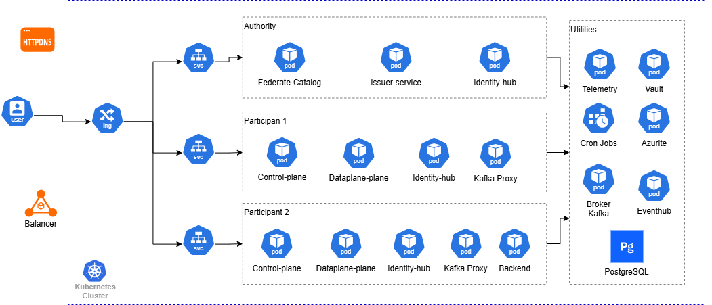
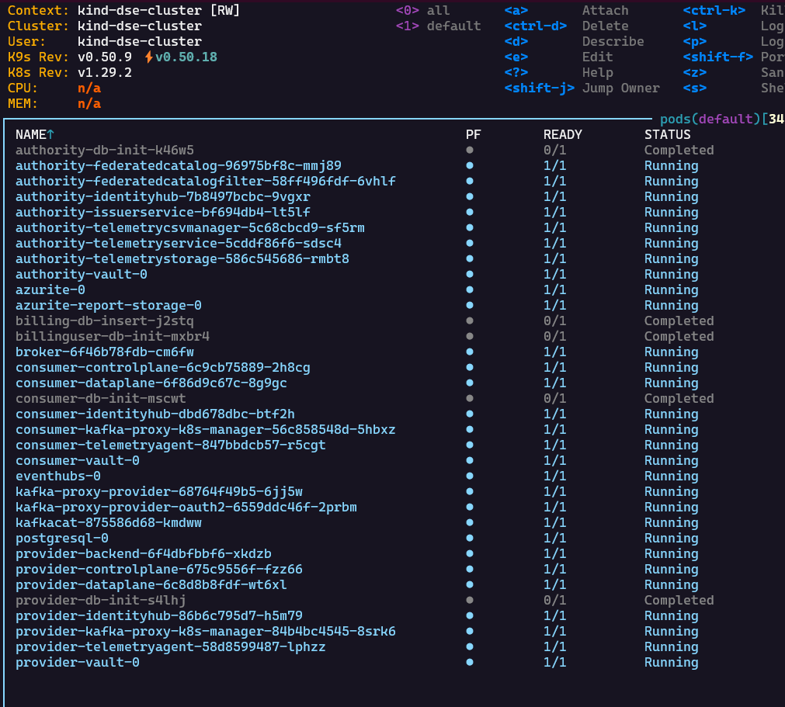

# MVD - EONAX

**Introduction**:

This document details the complete deployment and execution process for the **MVD de Eona-X** end-to-end tests..

**Project Context**

The objective is to validate the operation of a Minimum Viable Dataspace (MVD) that simulates secure data exchange between participants within the ecosystem.



Main Components

- **Authority**: Trusted authority that issues credentials.

- **Provider**: Organization that offers data/APIs.

- **Consumer**: Organization that consumes data.

**MVD Installation**

The basic steps for installing this MVD can be found in the following readme:

<https://github.com/AmadeusITGroup/dataspace-ecosystem/blob/main/system-tests/readme.md>

**Issues:**

When running the following command:
```
terraform -chdir=system-tests apply -auto-approve
-var=\"environment=local\"
```

The result failed because the Terraform scripts look for Docker images starting with localhost

For example `localhost/kafka-proxy-k8s-manager:latest`

To solve this problem, it is necessary to re-tag the built images:

```
docker tag control-plane-postgresql-hashicorpvault:latest \
localhost/control-plane-postgresql-hashicorpvault:latest

docker tag data-plane-postgresql-hashicorpvault:latest \
localhost/data-plane-postgresql-hashicorpvault:latest

docker tag federated-catalog-postgresql-hashicorpvault:latest \
localhost/federated-catalog-postgresql-hashicorpvault:latest

docker tag identity-hub-postgresql-hashicorpvault:latest \
localhost/identity-hub-postgresql-hashicorpvault:latest

docker tag issuer-service-postgresql-hashicorpvault:latest \
localhost/issuer-service-postgresql-hashicorpvault:latest

docker tag telemetry-service-postgresql-hashicorpvault:latest \
localhost/telemetry-service-postgresql-hashicorpvault:latest

docker tag telemetry-agent-postgresql-hashicorpvault:latest \
localhost/telemetry-agent-postgresql-hashicorpvault:latest

docker tag backend-service-provider:latest \
localhost/backend-service-provider:latest

docker tag telemetry-storage-postgresql-hashicorpvault:latest \
localhost/telemetry-storage-postgresql-hashicorpvault:latest

docker tag telemetry-csv-manager-postgresql-hashicorpvault:latest \
localhost/telemetry-csv-manager-postgresql-hashicorpvault:latest

docker tag federated-catalog-filter-postgresql-hashicorpvault:latest \
localhost/federated-catalog-filter-postgresql-hashicorpvault:latest

docker tag kafka-proxy-entra-auth:latest \
localhost/kafka-proxy-entra-auth:latest

docker tag kafka-proxy-k8s-manager:latest \
localhost/kafka-proxy-k8s-manager:latest
```
Then, it is necessary to load these images into the kind cluster as follows

```
kind load docker-image \
control-plane-postgresql-hashicorpvault:latest \
localhost/control-plane-postgresql-hashicorpvault:latest \
data-plane-postgresql-hashicorpvault:latest \
localhost/data-plane-postgresql-hashicorpvault:latest \
federated-catalog-postgresql-hashicorpvault:latest \
localhost/federated-catalog-postgresql-hashicorpvault:latest \
identity-hub-postgresql-hashicorpvault:latest \
localhost/identity-hub-postgresql-hashicorpvault:latest \
issuer-service-postgresql-hashicorpvault:latest \
localhost/issuer-service-postgresql-hashicorpvault:latest \
telemetry-service-postgresql-hashicorpvault:latest \
localhost/telemetry-service-postgresql-hashicorpvault:latest \
telemetry-agent-postgresql-hashicorpvault:latest \
localhost/telemetry-agent-postgresql-hashicorpvault:latest \
backend-service-provider:latest \
localhost/backend-service-provider:latest \
telemetry-storage-postgresql-hashicorpvault:latest \
localhost/telemetry-storage-postgresql-hashicorpvault:latest \
telemetry-csv-manager-postgresql-hashicorpvault:latest \
localhost/telemetry-csv-manager-postgresql-hashicorpvault:latest \
federated-catalog-filter-postgresql-hashicorpvault:latest \
localhost/federated-catalog-filter-postgresql-hashicorpvault:latest \
kafka-proxy-entra-auth:latest \
localhost/kafka-proxy-entra-auth:latest \
kafka-proxy-k8s-manager:latest \
localhost/kafka-proxy-k8s-manager:latest \
-n dse-cluster
```
**Why load the images?**

Kind is an isolated cluster. It needs to have the images available internally to deploy them.

After this, you must run the Terraform apply again:

`
terraform -chdir=system-tests apply -auto-approve
-var=\"environment=local\"`

The result should show the pods within the cluster in a `Running` or `Completed` state



What **terraform** deploys :

- **Base Infrastructure**

  - PostgreSQL (shared database)

  - Azure Event Hub (local emulator)

  - HashiCorp Vault (secret management)

  - Azurite (Azure Storage emulator)

  - Kafka Broker (for streaming)

- **For each participant (Authority, Provider, Consumer)**

  - Control Plane (contract and catalog management)

  - Data Plane (data transfer)

  - Identity Hub (identity management)

  - Vault (dedicated secrets instance)

  - Init jobs (database initialization)

- **Componentes específicos de Authority**

  - Issuer Service (credential issuance)

  - Federated Catalog (centralized catalog)

  - Telemetry Service (event collection)

  - Telemetry Storage (telemetry storage)

  - Telemetry CSV Manager (report generation)

- **Provider-specific components**

  - Backend Service (real data APIs)

  - Kafka Proxy Manager (Kafka proxy management)

  - Telemetry Agent (telemetry reporting)

- **Componentes específicos de Consumer**

  - Kafka Proxy Manager (Kafka proxy management)

  - Telemetry Agent (telemetry reporting)

**EndToEnd Test.**

The tests require direct access to Event Hub and PostgreSQL running in our kind cluster. To achieve this, execute the following commands:

```
kubectl port-forward eventhubs-0 52717:5672

kubectl port-forward postgresql-0 57521:5432 &
```
Afterward, you can run the End-to-End tests included in the project.

```./gradlew :system-tests:runner:test -DincludeTags=\"EndToEndTest\"```

This will execute the tests tagged with EndToEndTest in the runner submodule.

The following shows the result of a successful test execution:

If you wish to view the execution logs, you can do so as follows:

- Consumer logs (contract negotiation)

```kubectl logs -f deployment/consumer-controlplane```

- Provider logs (data transfer)

```kubectl logs -f deployment/provider-dataplane```

- Telemetry logs

```kubectl logs -f deployment/authority-telemetryservice```

The tests simulate a **complete data exchange flow** between three participants in a dataspace, validating everything from data discovery to telemetry report generation


## **Phase 1: Setup Inicial (@BeforeAll)**

### **¿What does it do?**

Prepares the entire ecosystem before running any tests.

### **Main Steps:**

1.  **Register participants with the Authority**

    - Creates 3 participants: Authority, Provider, Consumer.
    - Each with its own Decentralized Identity (DID).

2.  **Issue Verifiable Credentials**

    - MembershipCredential: Proves membership in the dataspace.
    - DomainCredential: Proves belonging to a specific domain (route/travel).
    - Each participant receives 2 credentials.

3.  **Publish 11 assets in the Provider**

    - REST APIs (basic, OAuth2, restricted).
    - Kafka Streams.
    - Each asset includes Metadata, DataAddress, and Policy.

**Resultado:** El ecosistema listo con participantes autenticados y
datasets disponibles.

## **PHASE 2: Catalog Tests (3 tests)**

### **What do they validate?**

That participants can discover which data is available in the dataspace.

### **Tests:**

#### **1.** catalog_provider()
```
✓ Authority queries Provider's catalog
✓ Validates that all 11 assets are available
✓ Verifies that each asset has a creation timestamp
```
#### **2.** catalog_consumer()
```
✓ The consumer consults its own catalogue
✓ It validates that it is empty (the consumer does not publish data)
```
#### **3.** catalog_consumer_restricted()
```
✓ The Consumer consults the Provider's catalogue
✓ It only sees assets from the ‘route’ domain (because it has DomainCredential
route)
✗ It does NOT see assets from the ‘travel’ domain (it does not have that credential)
✓ It validates that discovery is restricted by credentials
```
**Result:** Catalogue discovery works and complies with visibility policies.

## **PHASE 3: Transfer Tests (11 tests))**

### **What do they validate?**

That participants can negotiate contracts and transfer data securely.

### **General transfer flow:**

1. Discover asset in catalogue
2. Negotiate contract (validate policies and credentials)
3. Initiate transfer (obtain access token)
4. Consume data (using token)
5. Send telemetry

### **Tests principales:**

#### **1.** transfer_success() **- 4 variaciones**
```
✓ Transfer basic REST API data
✓ Transfer API data with domain restriction
✓ Transfer API data with OAuth2
✓ Transfer API data with embedded parameters
✓ Validate that the data received is correct
```
#### **2.** transfer_kafka_stream_oauth()
```
✓ Negotiates contract for Kafka stream with OAuth2
✓ Deploys Kafka proxy dynamically
✓ Completes transfer successfully
```
#### **3.** transfer_kafka_stream()
```
✓ Negotiate contract for Kafka stream
✓ Automatically deploy Kafka proxy on Kubernetes
✓ Provider publishes message: “Hello from provider!”
✓ Consumer reads message through proxy
✓ Validate that message arrived correctly
✓ Clean up proxy after transfer
```
#### **4.** transfer_failure()
```
✓ Attempt to transfer data from a failing API (500 error)
✓ Validate that the error is handled correctly
✓ Verify appropriate error message
```
#### **5.** transfer_whenContractExpiration_shouldTerminateTransferProcessAtExpiration()
```
✓ Transfer data from an API with a contract that expires in 20 seconds
✓ Validate that the data is initially accessible
⏱️ Wait 25 seconds
✓ Validate that access is automatically blocked
✓ Verify that the transfer process is terminated (TERMINATED)
```
#### **6.** transfer_retireAgreement_shouldBlockFurtherAccess()
```
✓ Successfully transfers data
✓ Provider manually withdraws the contract
✓ Validates that access is immediately blocked
✓ Provider reactivates the contract
✓ Validates that access is restored
✓ Verifies the complete withdrawal/reactivation cycle
```
#### **7.** transfer_forRestrictedDiscoveryAssets()
```
✓ Transfer asset data with restricted discovery
✓ Consumer has the correct credential (domain=route)
✓ Validate that the transfer is successful
```
#### **8.** transfer_forRestrictedDiscoveryAssets_NotAvailable()
```
✓ Intenta transferir asset con descubrimiento restringido
✗ Consumer NO tiene la credencial correcta (necesita domain=travel)
✓ Valida que la negociación se termina (TERMINATED)
```
#### **9.** transfer_whenPolicyNotMatched_shouldTerminate()
```
✓ Attempt to negotiate a contract with an impossible policy
✓ Validate that the negotiation is automatically rejected
✓ Verify TERMINATED status
```
**Result:**  The system negotiates contracts, validates policies,
transfers HTTP and Kafka data, and handles errors correctly.

## **FASE 4: Report Tests ( (4 tests)**

### **What do they validate?**

That the system collects telemetry and generates monthly CSV reports.

### **Tests:**

#### **1.** testReportGenerationSucceeds()
```
✓ Create simulated telemetry events (consumer and provider)
✓ Request CSV report generation for September 2025
✓ Retrieve the report using JWT authentication
✓ Validate CSV format:
  - contract_id
  - data_transfer_response_status (200)
  - total_transfer_size_in_kB (0.02)
  - total_number_of_events (1)
✓ Verify that it works with JWTs with multiple roles
```
#### **2.** testReportGenerationWithOnlyOnePartySucceeds()
```
✓ Creates telemetry event only from the consumer (without provider)
✓ Successfully generates report with partial data
✓ Validates that the system is robust in the face of incomplete data
```
#### **3.** testRetrieveReportWithNonExistentParticipantFails()
```
✓ Attempt to obtain a report with a non-existent participant's JWT
✓ Validate that it returns 403 Forbidden
✓ Verify system security
```
#### **4.** testRetrieveNonExistentReportFromExistentParticipantFails()
```
✓ Attempt to obtain a report that does not exist
✓ Validate that it returns 404 Not Found
✓ Verify correct error handling
```
**Result:** The system collects telemetry, generates monthly reports,
and protects access with authentication.

## **PHASE 5: Cleanup (@AfterAll)**

### **What does it do?**

Processes pending telemetry events and validates storage.

### **Steps:**
```
1. Connect to Event Hub
2. Consume all telemetry events generated during testing
3. Send each event to the Authority Telemetry Service
4. Validate that the data was saved in PostgreSQL
5. Verify that all contracts were processed (timeout: 1 minute)
```
**Result:** All telemetry events are stored and ready to generate reports.

## **Components Involved**
| Component | Role in Tests |
| :--- | :--- |
| **authority-identityhub** | Stores participant identities |
| **authority-issuerservice** | Issues verifiable credentials |
| **authority-federatedcatalog** | Collects catalogs from all participants |
| **authority-telemetryservice** | Receives telemetry events |
| **authority-telemetrycsvmanager** | Generates monthly CSV reports |
| **provider-controlplane** | Publishes assets and negotiates contracts |
| **provider-dataplane** | Transfers actual data |
| **provider-backend** | Real data APIs and services |
| **consumer-controlplane** | Discovers data and negotiates contracts |
| **consumer-dataplane** | Consumes transferred data |
| **PostgreSQL** | Stores all persistent data |
| **Event Hub** | Telemetry event queue |
| **Kafka** | Real-time data streaming |
| **Vault** | Secret and key management |
