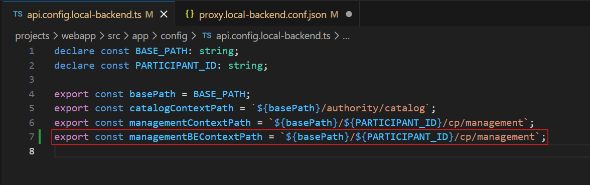
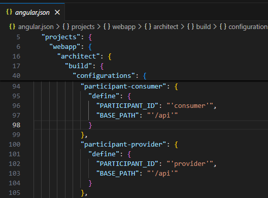
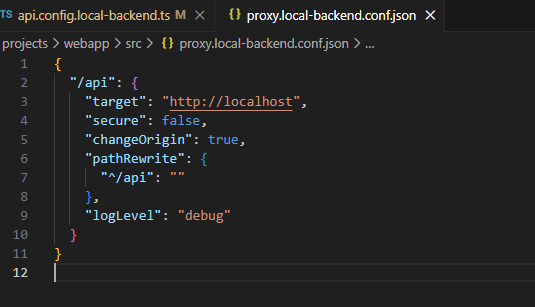

# Despliegue Local de MVDS-UI

Este documento describe los pasos necesarios para ejecutar en local la interfaz de usuario del proyecto **MVDS**.

---

## 1. Clonar el repositorio

Descargar la interfaz desde el repositorio:

```bash
git clone https://github.com/AmadeusITGroup/Dataspace_UI.git
```

---

## 2. Instalar las dependencias

Desde la raíz del proyecto ejecutar:

```bash
npm install
```

---

## 3. Configurar el backend local

Abrir el proyecto y modificar el archivo `api.config.local-backend.ts` para añadir en este la constante `managementBEContextPath`, necesaria para el arranque de la aplicación.



Las constantes `basePath` y `PARTICIPANT_ID` se configuran en el archivo `angular.json` del proyecto, por defecto vienen como se ve en la imagen.



---

## 4. Arrancar la aplicación

Ejecutar uno de los siguientes comandos:

```bash
npm run start:local-backend-provider
npm run start:local-backend-consumer
```

---

## 5. Configurar el proxy hacia el backend

Modificar el archivo `proxy.local-backend.conf.json` y actualizar la propiedad `target` para que apunte a la URL del entorno donde se encuentra el backend.


